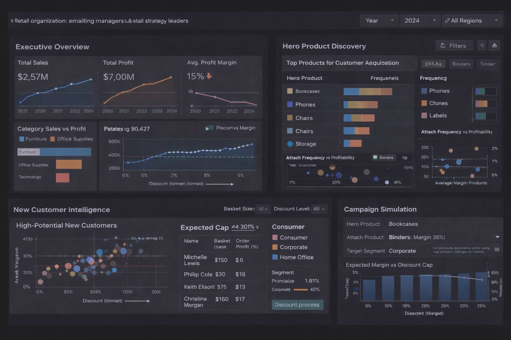

# Dashboard Description

This application is an interactive decision-supported dashboard designed for retail marketing managers planning promotional campaigns. The interface guides users from business performance metrics to customer growth tactics. 

At the top of the dashboard, an Executive Overview panel summarizes the overall performance. Line charts display the total sales total profits and the average profit margin over time. A category comparison chart highlights differences between revenue-driving and profit-driving product groups. A discount-versus-margin plot establishes pricing guardrails by showing how increasing discounts impact profitability.

The Hero Product Discovery panel focuses on customer acquisition. This panel will show "hero products" which are the most purchased product which frequently appear in customers' first purchase. Selecting one of these hero products will update companion visuals to display other products frequently bought with it. This will allow marketing managers to make decisions that could potentially attach new customers by creating bundles.

The New Customer Intelligence section is used to identify which new customers are likely to be profitable. By comparing discount usage, basket size and margins, marketing managers can distinguish high-potential customers from discount-driven ones.

In the Campaign Simulation panel allows users to test potential marketing strategies. By selecting the hero product along with other frequently purchased items, and selecting a discount cap, the dashboard estimates the expected impact on sales and profit margin. This helps evaluate trade-offs and design promotions that attract customers while maintaining profitability. 

**Design Note:** The dashboard mockup shown below was generated using generative AI to illustrate the intended user experience and layout. The final implemented dashboard may differ in appearance and functionality as development progresses.