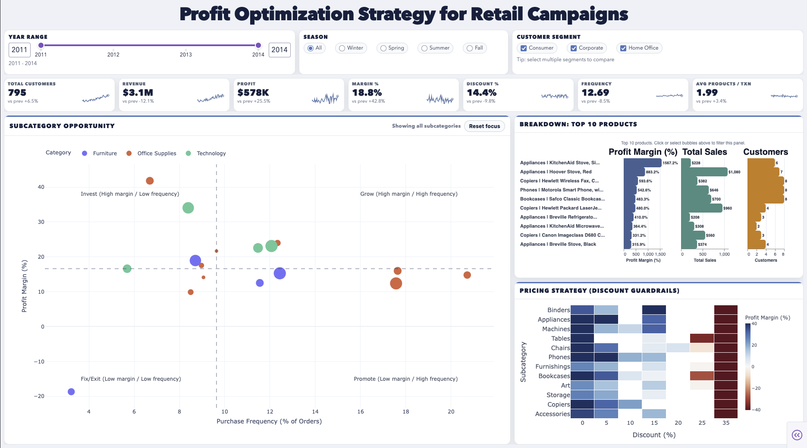

# Profit Optimization Dashboard for Retail Campaigns

Interactive retail decision dashboard built with Dash, Plotly, and Altair.
It helps teams balance growth and profitability by linking subcategory opportunity, product performance, and discount guardrails in one screen.

## Live App
https://mds-data-551-project-1.onrender.com/

## What The Dashboard Does
The app supports promo and pricing decisions by showing:
- KPI trends for customers, revenue, profit, margin, discount, frequency, and average products per transaction
- Subcategory opportunity positioning (frequency vs. margin) to find where to invest, grow, promote, or fix
- Product-level breakdown of the top 10 items by profitability context
- Discount guardrail heatmap to see how discount buckets relate to margin by subcategory

## How To Use It
### 1) Set global filters
Use the control row to filter by:
- Year range (slider)
- Season (All/Winter/Spring/Summer/Fall)
- Customer segment (multi-select)

All charts and KPIs update from these filters.

### 2) Read KPI cards
The KPI row summarizes current performance for the active filters.
Each card includes a small sparkline and a delta vs. the previous period.

### 3) Use Subcategory Opportunity interactions
The bubble chart is the main interaction driver.
- Hover: shows category, subcategory, sales, frequency %, and margin %
- Click a bubble: focuses on that subcategory and filters the bottom panels
- Box/lasso select: focuses on multiple bubbles/subcategories
- Reset focus: clears selection and returns all panels to the full filtered view

### 4) Inspect Breakdown: Top 10 Products
This panel reflects the active focus state.
- Shows profit margin %, total sales, and customer count for top products
- Hover reveals full product labels/metrics where labels are truncated

### 5) Inspect Pricing Strategy (Discount Guardrails)
This heatmap also respects the active focus state.
- X-axis: discount boundaries (0, 5, 10, 15, 20, 25, 35)
- Y-axis: subcategories
- Color: profit margin (%) from negative (red) to positive (blue)
- Hover: subcategory, discount bucket, orders, total sales, and profit margin

## Interaction Model
- Selection is durable: once focused, state remains active until you reset focus or change global filters.
- Reset focus clears active subcategory selection and restores the default (unfocused) dashboard state.
- Hover interactions are informational and do not override an active focus state.

## Tech Stack
- Python
- Dash
- Plotly
- Altair
- Pandas
- NumPy
- Gunicorn

## Run Locally
From the project root:

```bash
python -m pip install -r requirements.txt
python src/app.py
```

Data source:
`data/raw/SuperStoreOrders.csv`

## Project Structure
```text
project/
├── data/
│   ├── processed/
│   └── raw/
├── images/
├── src/
│   ├── app.py
│   ├── charts.py
│   └── data.py
├── reports/
├── doc/
├── requirements.txt
├── README.md
├── CODE_OF_CONDUCT.md
├── CONTRIBUTING.md
└── LICENSE.md
```

## Preview

