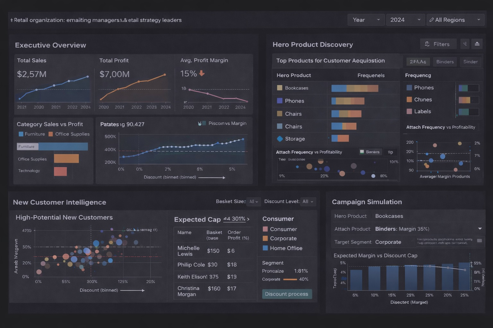

# Retail Analytics Dashboard

An interactive dashboard built with Dash + Altair to help retail teams answer a core question:
how do we grow revenue without sacrificing margin?

The app combines trend monitoring, product-level profitability, and basket/pricing intelligence in one place.

## Live App
Deployed dashboard:  
https://mds-data-551-project-1.onrender.com/

## Why This Project
Retail promo decisions are often made with partial context: one team optimizes volume, another watches margin, and basket effects are reviewed separately. That fragmentation can lead to underperforming campaigns.

This project provides a single decision surface for:
- Profit-aware trend analysis
- Product performance diagnostics
- Cross-sell and discount guardrails

## What Users Can Do
At a high level, users can:
- Filter the dashboard by year, month, and country
- Track revenue/profit/margin trends
- Identify top profit-driving products
- Explore co-purchase patterns and bundle opportunities
- Evaluate discount ranges against margin outcomes

## Dashboard Sections
### Section 1: Trends & Breakdown
- KPI context for topline performance
- Time-based charts for sales, profit, and margin
- Category-level sales interaction that filters section charts

### Section 2: Product Performance
- Product-performance KPI (`Hero Profit`)
- Top products by total profit
- Product panel with profit margin, sales, and customer reach

### Section 3: Basket & Pricing Intelligence
- Basket KPIs (`Average Basket Spend`, `Attach Rate`, `Avg Co-products`)
- Subcategory discovery bubble (frequency vs margin)
- Top co-purchases
- Bundle table (support/confidence/lift)
- Discount guardrail heatmap

## Tech Stack
- Python
- Dash
- Altair
- Pandas
- NumPy
- Gunicorn

## Run Locally
From the project root:

```bash
python -m pip install -r requirements.txt
python src/app.py
```

The app reads data from:
`data/raw/SuperStoreOrders.csv`


## Help Wanted
Areas where contributions would be especially useful:
- Accessibility improvements (contrast, keyboard navigation, labels)
- Automated tests for data transforms and callback logic
- Mobile/responsive layout improvements
- Faster rendering for larger datasets
- Better onboarding docs and a short dashboard demo GIF

## Project Structure
```text
project/
├── data/
│   ├── processed/
│   └── raw/
├── src/
│   ├── app.py
│   ├── charts.py
│   └── data.py
├── reports/
├── doc/
├── requirements.txt
├── README.md
├── CODE_OF_CONDUCT.md
├── CONTRIBUTING.md
└── LICENSE.md
```

## Preview

